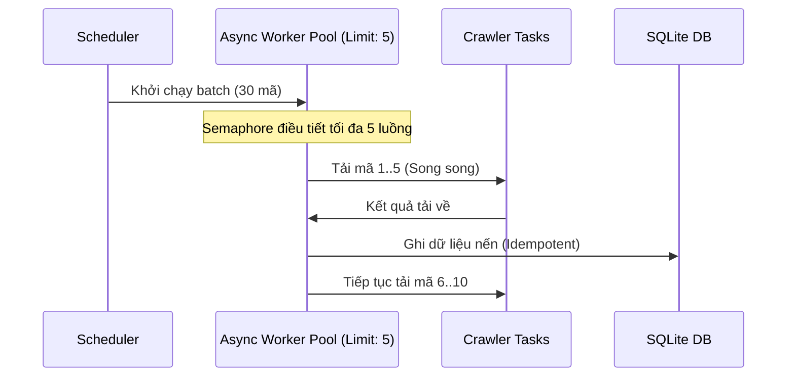

# Kế hoạch & Thiết kế Chi tiết các Tính năng Nâng cấp: Chart-Volume

Tài liệu này mô tả chi tiết phương án kỹ thuật, các file cần sửa đổi, cấu trúc code mẫu và cách thức triển khai cho từng gợi ý phát triển dự án **Chart-Volume**.

---

## 1. Tối ưu hóa Crawler Song song Bất đồng bộ (Async Crawler)

### 📌 Vấn đề hiện tại
Trong [scheduler.py](file:///Users/dinhson/IdeaProjects/chart-volume/backend/app/scheduler.py), hàm `run_batch` và `run_crypto_batch` duyệt qua danh sách các mã (`Symbol`) bằng vòng lặp `for` tuần tự. Khi số lượng mã trong Watchlist lớn, quá trình crawl qua HTTP sẽ tốn nhiều thời gian chờ phản hồi từ API (I/O Bound).

### 🛠 Giải pháp kỹ thuật
Sử dụng `asyncio` kết hợp với `Semaphore` để giới hạn số lượng request đồng thời (ví dụ: tối đa 5 luồng song song) nhằm tránh bị các API bên thứ ba (`vnstock`, CoinGecko, Binance...) chặn/rate-limit.



### 📂 Các file liên quan & Công việc cụ thể
* **[ingest.py](file:///Users/dinhson/IdeaProjects/chart-volume/backend/app/services/ingest.py)**: Chuyển các hàm crawl sang dạng `async def`, sử dụng `httpx.AsyncClient` thay cho requests thông thường.
* **[scheduler.py](file:///Users/dinhson/IdeaProjects/chart-volume/backend/app/scheduler.py)**:
  * Viết lại `run_batch` sử dụng `asyncio.gather` và `asyncio.Semaphore`.
  * Cần cấu hình `BackgroundScheduler` hỗ trợ chạy async job hoặc bọc async loop trong thread riêng.

### 📝 Cấu trúc Code mẫu (Python)
```python
import asyncio
from app.services import ingest
from app.services.analysis import run_analysis

async def ingest_and_analyze_single(session, ticker, timeframe, semaphore, use_ai=True):
    async with semaphore:
        try:
            # Crawl dữ liệu bất đồng bộ
            await ingest.ingest_daily_async(session, ticker)
            # Chạy phân tích (CPU-bound có thể bọc trong asyncio.to_thread nếu cần)
            await asyncio.to_thread(run_analysis, session, ticker, timeframe, use_ai=use_ai)
            return ticker, True
        except Exception as exc:
            return ticker, False

async def run_batch_async(session, timeframe, symbols, max_concurrency=5):
    semaphore = asyncio.Semaphore(max_concurrency)
    tasks = [
        ingest_and_analyze_single(session, sym.ticker, timeframe, semaphore)
        for sym in symbols
    ]
    results = await asyncio.gather(*tasks)
    return results
```

---

## 2. Hệ thống Cảnh báo tự động qua Telegram/Discord Bot

### 📌 Vấn đề hiện tại
Người dùng phải mở ứng dụng Desktop trực tiếp mới biết được mã nào vừa xuất hiện tín hiệu Wyckoff hay SMC mới. 

### 🛠 Giải pháp kỹ thuật
Tích hợp một dịch vụ gửi tin nhắn cảnh báo. Khi scheduler tự động hoàn thành phân tích hoặc khi người dùng chạy quét thủ công và phát hiện các sự kiện quan trọng (như *Spring*, *Upthrust*, *SMC BOS*), hệ thống sẽ gửi tin nhắn đến Telegram/Discord.

```
[Mã cổ phiếu] + [Chiến lược] -> Phát hiện tín hiệu -> Gọi Telegram Bot API -> Điện thoại người dùng
```

### 📂 Các file liên quan & Công việc cụ thể
* **[models.py](file:///Users/dinhson/IdeaProjects/chart-volume/backend/app/models.py)**: Thêm các cột cài đặt `telegram_bot_token`, `telegram_chat_id`, `enable_alerts` vào bảng `Setting`.
* **[settings.py](file:///Users/dinhson/IdeaProjects/chart-volume/backend/app/api/settings.py)**: Thêm API endpoint để lưu và kiểm tra (test connection) thông tin Bot.
* **Tạo file mới `backend/app/services/alert.py`**:
  * Định nghĩa hàm `send_telegram_notification(token, chat_id, message)`.
* **[analysis.py](file:///Users/dinhson/IdeaProjects/chart-volume/backend/app/services/analysis.py)**: Sau khi chạy xong `run_analysis` và phát hiện tín hiệu mới (`result.events`), gọi dịch vụ Alert để gửi tin nhắn.

### 📝 Cấu trúc Code mẫu (Python)
```python
import httpx

def send_telegram_alert(bot_token: str, chat_id: str, ticker: str, event_type: str, price: float, phase: str, summary: str):
    url = f"https://api.telegram.org/bot{bot_token}/sendMessage"
    text = (
        f"🚨 <b>CẢNH BÁO TÍN HIỆU MỚI: {ticker}</b>\n\n"
        f"• <b>Tín hiệu</b>: {event_type}\n"
        f"• <b>Giá xảy ra</b>: {price:,.2f}\n"
        f"• <b>Giai đoạn hiện tại</b>: {phase}\n\n"
        f"📝 <b>Nhận định AI nhanh</b>:\n<i>{summary}</i>"
    )
    payload = {
        "chat_id": chat_id,
        "text": text,
        "parse_mode": "HTML"
    }
    with httpx.Client() as client:
        resp = client.post(url, json=payload)
        resp.raise_for_status()
```

---

## 3. Bộ công cụ Kiểm thử Chiến lược & Thống kê trực quan (Visual Backtester)

### 📌 Vấn đề hiện tại
Bảng [SignalOutcome](file:///Users/dinhson/IdeaProjects/chart-volume/backend/app/models.py#L131) đang ghi nhận dữ liệu tỷ lệ lời/lỗ sau 5, 10, 20 nến nhưng chưa có giao diện tổng hợp cho người dùng để so sánh hiệu quả giữa các chiến lược.

### 🛠 Giải pháp kỹ thuật
Xây dựng một module phân tích thống kê giúp tính toán tỷ lệ thắng (Win Rate), mức sinh lời trung bình của từng sự kiện để nhà đầu tư biết được "Tín hiệu nào có xác suất thành công cao nhất".

```
        Tín hiệu (SC/Spring/BOS...)
                    │
                    ▼
     Tìm lịch sử trong SignalOutcome
                    │
                    ▼
     Tính Win Rate = (Số lần Win / Tổng số lần) * 100
                    │
                    ▼
     Hiển thị biểu đồ cột trên React UI
```

### 📂 Các file liên quan & Công việc cụ thể
* **Tạo file mới `backend/app/services/stats_service.py`**:
  * Viết hàm truy vấn cơ sở dữ liệu bảng `SignalOutcome`, gom nhóm theo `strategy`, `event_type` để tính:
    * Tổng số tín hiệu phát hiện.
    * Tỷ lệ thắng (lợi nhuận > 0) tại các mốc 5, 10, 20 nến.
    * Lợi nhuận trung bình đạt được.
* **Tạo API Endpoint `backend/app/api/stats.py`**: Khai báo đường dẫn `GET /analysis/stats` trả về dữ liệu JSON của các tính toán trên.
* **Tạo Component React mới `desktop/src/components/stats/SignalWinRateDashboard.tsx`**:
  * Hiển thị bảng số liệu thống kê.
  * Sử dụng biểu đồ trực quan (có thể vẽ bằng thẻ CSS/HTML Flexbox đơn giản hoặc Canvas) để người dùng dễ so sánh.

### 📝 Cấu trúc API Response mẫu (JSON)
```json
[
  {
    "strategy": "wyckoff",
    "event_type": "Spring",
    "total_signals": 42,
    "win_rate_5": 72.5,
    "win_rate_10": 80.0,
    "win_rate_20": 68.2,
    "avg_return_10": 5.43
  },
  {
    "strategy": "smc",
    "event_type": "BOS",
    "total_signals": 105,
    "win_rate_5": 58.1,
    "win_rate_10": 62.4,
    "win_rate_20": 65.0,
    "avg_return_10": 3.12
  }
]
```

---

## 4. Chiến lược Phân tích Đa Khung Thời Gian (Multi-timeframe)

### 📌 Vấn đề hiện tại
Hiện tại, khi phân tích khung thời gian nhỏ (như `half_session` cho cổ phiếu hay `1h`/`4h` cho crypto), hệ thống chỉ lấy thông tin xu hướng `daily_trend` như một trường tham chiếu và hiển thị mức độ đồng nhất (`mtf_alignment`). Chưa có sự kết hợp chặt chẽ để lọc tín hiệu nhiễu.

### 🛠 Giải pháp kỹ thuật
Nâng cấp logic trong các bộ lọc sự kiện. Ví dụ:
* Tín hiệu **SOS** (Sign of Strength) xuất hiện trên khung `1h` sẽ được tăng điểm số tin cậy (`confidence`) nếu xu hướng chủ đạo Daily là tích lũy/tăng giá (Accumulation/Markup).
* Ngược lại, nếu khung Daily đang ở giai đoạn phân phối (Distribution), các tín hiệu mua ở khung nhỏ sẽ bị đánh dấu là "Cảnh báo bẫy tăng giá (Bull Trap)".

### 📂 Các file liên quan & Công việc cụ thể
* **[base.py](file:///Users/dinhson/IdeaProjects/chart-volume/backend/app/strategies/base.py)**: Cập nhật định nghĩa interface `analyze` để bắt buộc nhận cấu trúc xu hướng đa khung thời gian.
* **[events.py](file:///Users/dinhson/IdeaProjects/chart-volume/backend/app/wyckoff/events.py)**: Điều chỉnh hàm `detect_events` để kiểm tra điều kiện xu hướng Daily. Các sự kiện SOS hoặc SOW sẽ được đính kèm nhãn cảnh báo dựa trên `daily_trend`.
* **[CandleChart.tsx](file:///Users/dinhson/IdeaProjects/chart-volume/desktop/src/components/chart/CandleChart.tsx)**:
  * Vẽ thêm một đường chỉ báo xu hướng của khung Daily (ví dụ: EMA200 Daily) mờ trên biểu đồ khung nhỏ để người dùng dễ so sánh trực quan.

---

## 5. Bộ Công cụ Vẽ Tương tác trên Biểu đồ (Interactive Drawing)

### 📌 Vấn đề hiện tại
Thư viện `lightweight-charts` hiển thị các sự kiện định lượng rất tốt, nhưng người dùng không thể tự vẽ thêm các đường xu hướng riêng hoặc ghi chú vùng kháng cự theo ý mình.

### 🛠 Giải pháp kỹ thuật
Kích hoạt tính năng vẽ tự do bằng cách bắt các sự kiện chuột (MouseDown, MouseMove, MouseUp) trên vùng chứa Canvas của biểu đồ. Dữ liệu các nét vẽ sẽ được lưu trữ vào SQLite để hiển thị lại khi người dùng truy cập lại mã đó.

```
 Người dùng bấm công cụ vẽ -> Click & Kéo trên Chart -> Lưu danh sách tọa độ (X1, Y1, X2, Y2) -> Lưu SQLite
                                                                                               │
 Load mã cổ phiếu <- Đọc SQLite <- Vẽ đè (Overlay Layer) lên lightweight-charts <────────────────┘
```

### 📂 Các file liên quan & Công việc cụ thể
* **[models.py](file:///Users/dinhson/IdeaProjects/chart-volume/backend/app/models.py)**:
  * Tạo bảng mới tên là `UserDrawing` chứa: `id`, `ticker`, `asset_class`, `shapes_json` (chứa toạ độ vẽ, loại hình như Line/Box, màu sắc), `updated_at`.
* **Tạo file API mới `backend/app/api/drawings.py`**: Endpoint `GET /drawings/{ticker}` và `POST /drawings/{ticker}` để lưu trữ nét vẽ.
* **[CandleChart.tsx](file:///Users/dinhson/IdeaProjects/chart-volume/desktop/src/components/chart/CandleChart.tsx)**:
  * Tích hợp chế độ Vẽ (Drawing Mode). Khi bật chế độ này, bắt sự kiện click chuột để tính giá trị Price/Time tương ứng từ toạ độ màn hình.
  * Sử dụng thư viện ngoài hoặc tính năng Custom Series/Plugins của lightweight-charts để render các nét vẽ đè lên biểu đồ nến.

---

## 6. Đồng bộ hóa Đám mây & Kiến trúc Web App

### 📌 Vấn đề hiện tại
Cơ sở dữ liệu SQLite nằm cố định ở máy khách Desktop. Người dùng không thể chia sẻ watchlist hoặc xem kết quả phân tích trên điện thoại di động khi không ngồi trước máy tính.

### 🛠 Giải pháp kỹ thuật
Chuyển đổi cơ chế lưu trữ để tương thích cả cơ sở dữ liệu cục bộ (SQLite) lẫn cơ sở dữ liệu đám mây (**PostgreSQL**). Tạo file `Dockerfile` để đóng gói backend chạy độc lập trên máy chủ VPS.

```
       ┌────────────────────────┐
       │   Dockerized Backend   │
       │   (FastAPI + Celery)   │
       └───────────┬────────────┘
                   │
         ┌─────────┴─────────┐
         ▼                   ▼
 ┌──────────────┐    ┌──────────────┐
 │ PostgreSQL   │    │  Redis Cache │
 └──────────────┘    └──────────────┘
```

### 📂 Các file liên quan & Công việc cụ thể
* **[db.py](file:///Users/dinhson/IdeaProjects/chart-volume/backend/app/db.py)**:
  * Đọc chuỗi kết nối từ biến môi trường `DATABASE_URL`.
  * Nếu chứa `postgresql://` thì tạo engine PostgreSQL, ngược lại mặc định dùng SQLite để tương thích ngược với chế độ chạy Desktop offline.
* **Tạo file `backend/Dockerfile`**:
  ```dockerfile
  FROM python:3.12-slim
  WORKDIR /app
  COPY requirements.txt .
  RUN pip install --no-cache-dir -r requirements.txt
  COPY . .
  EXPOSE 8787
  CMD ["uvicorn", "app.main:app", "--host", "0.0.0.0", "--port", "8787"]
  ```
* **[main.cjs](file:///Users/dinhson/IdeaProjects/chart-volume/desktop/electron/main.cjs)**:
  * Thêm cấu hình trong phần Cài đặt cho phép người dùng chọn: "Chạy Backend cục bộ" hoặc "Kết nối đến Cloud Backend" thông qua URL API.

---

*Tài liệu thiết kế chi tiết này giúp nhà phát triển định hướng và lựa chọn chính xác các bước thực hiện tiếp theo dựa trên kiến trúc hiện tại của dự án.*
